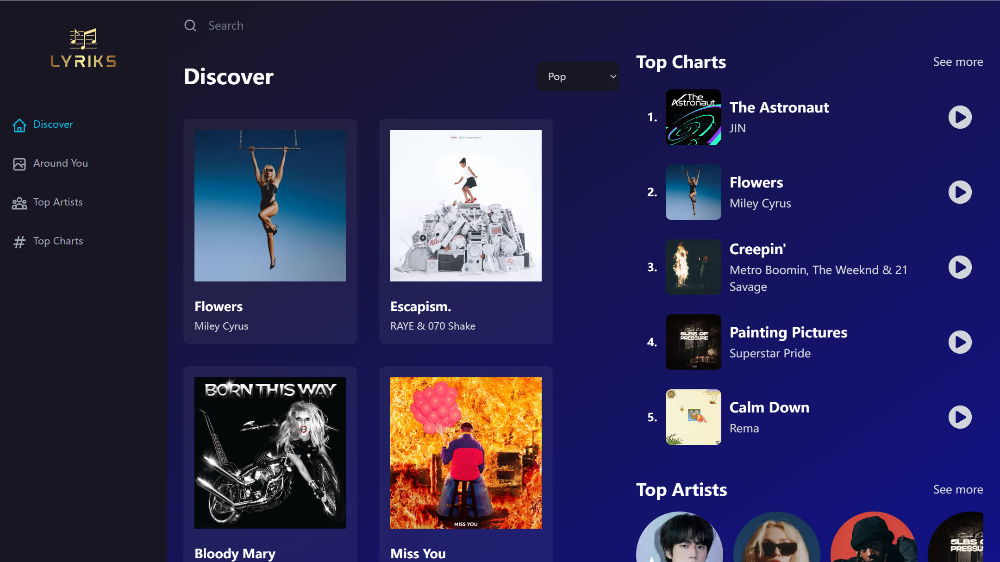
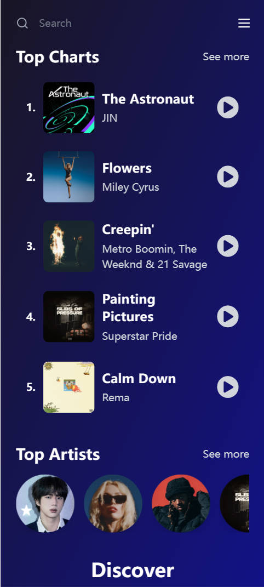

# Project Lyrics

A Spotify 2.0 Clone Music App with React 18 (Tailwind, Redux, RapidAPI)

According to the original [project](https://github.com/adrianhajdin/project_music_player)

<figure class="half">
    
    
</figure>

## System Requirements

To get started with development, you need to install few tools

1. git 
   
   `git` version 2.13.1 or higher. Download [git](https://git-scm.com/downloads) if you don't have it already.

   To check your version of git, run:

   ```shell
    git --version
   ```

2. node 
   
   `node` version 16.15.1 or higher. Download [node](https://nodejs.org/en/download/) if you don't have it already.

   To check your version of node, run:

   ```shell
    node --version
   ```

3. npm
  
   `npm` version 5.6.1 or higher. You will have it after you install node.

   To check your version of npm, run:

   ```shell
    npm --version
   ```

